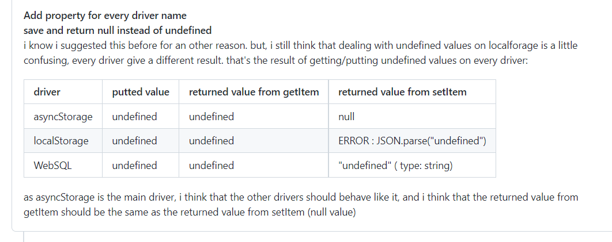

## 前言

localStorage 是前端本地存储的一种方式，容量在 5M ~ 10M，可以用来缓存一些简单的数据

但是如果需要存储大量的本地数据，localStorage 就不够用了。当然，浏览器也提供了存储大量本地数据的解决方案，如：[IndexedDB](https://developer.mozilla.org/zh-CN/docs/Web/API/IndexedDB_API)。


查看了 MDN 文档，IndexedDB 的功能十分强大， 但直接使用太复杂。所以我们去用一下 MDN 推荐的库：localForage 和 idb-keyval 。

## [localForage](http://localforage.docschina.org/#localforage)

localForage 拥有与 localStorage 类似的 API，方式为异步存储。它能存储多种类型的数据。
* Array
* ArrayBuffer
* Blob
* Float32Array
* Float64Array
* Int8Array
* Int16Array
* Int32Array
* Number
* Object
* Uint8Array
* Uint8ClampedArray
* Uint16Array
* Uint32Array
* String
  
> localForage 有一个优雅降级策略，若浏览器不支持 IndexedDB 或 WebSQL，则使用 localStorage。在所有主流浏览器中都可用：Chrome，Firefox，IE 和 Safari（包括 Safari Mobile）。

localForage 可以通过回调方式使用，同时也支持 ES6 Promises 的调用方式。

### 安装和引入

```js
// 通过 npm 安装：
npm install localforage

// 通过 bower：
bower install localforage

<script src="localforage.js"></script>
<script>console.log('localforage is: ', localforage);</script>
```

### getItem(key, successCallback)  获取存储中 key 对应的的数据

示例：
```js
localforage.getItem('somekey').then(function(value) {
    // 当离线仓库中的值被载入时，此处代码运行
    console.log(value);
}).catch(function(err) {
    // 当出错时，此处代码运行
    console.log(err);
});

// 回调版本：
localforage.getItem('somekey', function(err, value) {
    // 当离线仓库中的值被载入时，此处代码运行
    console.log(value);
});
```
> 当存储 undefined 时， getItem() 也会返回 null。[由于 localStorage 限制](https://github.com/localForage/localForage/pull/42)，同时出于兼容性的原因 localForage 无法存储 undefined。

* localForage 存储 undefined，会返回 null
* localStorage 存储 undefined，会报错 ERROR : JSON.parse("undefined")
* WebSQL 存储 undefined，会返回 "undefined" （字符串形式的 undefined)
  
### setItem(key, value, successCallback)  把数据添加到存储中，并为其设置 key

```js
localforage.setItem('somekey', 'some value').then(function (value) {
    // 当值被存储后，可执行其他操作
    console.log(value);
}).catch(function(err) {
    // 当出错时，此处代码运行
    console.log(err);
});

// 不同于 localStorage，你可以存储非字符串类型
localforage.setItem('my array', [1, 2, 'three']).then(function(value) {
    // 如下输出 `1`
    console.log(value[0]);
}).catch(function(err) {
    // 当出错时，此处代码运行
    console.log(err);
});

// 你甚至可以存储 AJAX 响应返回的二进制数据
req = new XMLHttpRequest();
req.open('GET', '/photo.jpg', true);
req.responseType = 'arraybuffer';

req.addEventListener('readystatechange', function() {
    if (req.readyState === 4) { // readyState 完成
        localforage.setItem('photo', req.response).then(function(image) {
            // 如下为一个合法的  标签的 blob URI
            var blob = new Blob([image]);
            var imageURI = window.URL.createObjectURL(blob);
        }).catch(function(err) {
          // 当出错时，此处代码运行
          console.log(err);
        });
    }
});
```
> 当使用 localStorage 和 WebSQL 作为后端时，二进制数据在保存（和检索）之前会被序列化。在保存二进制数据时，序列化会导致大小增大。

### removeItem(key, successCallback) 从存储中删除 key 对应的数据

示例：
```js
localforage.removeItem('somekey').then(function() {
    // 当值被移除后，此处代码运行
    console.log('Key is cleared!');
}).catch(function(err) {
    // 当出错时，此处代码运行
    console.log(err);
});
```

### clear(successCallback)  删除存储中所有的数据（谨慎使用）

```js
localforage.clear().then(function() {
    // 当数据库被全部删除后，此处代码运行
    console.log('Database is now empty.');
}).catch(function(err) {
    // 当出错时，此处代码运行
    console.log(err);
});
```
### length(successCallback) 获取存储中数据（key）的数量

```js
localforage.length().then(function(numberOfKeys) {
    // 输出数据库的大小
    console.log(numberOfKeys);
}).catch(function(err) {
    // 当出错时，此处代码运行
    console.log(err);
});
```

### key(keyIndex, successCallback) 根据 key 的索引获取 key的名称
> 这个 API 是从 localStorage 延续而来的
```js
localforage.key(2).then(function(keyName) {
    // key 名
    console.log(keyName);
}).catch(function(err) {
    // 当出错时，此处代码运行
    console.log(err);
});
```

### keys(successCallback) 获取存储中所有的 key

```js
localforage.keys().then(function(keys) {
    // 包含所有 key 名的数组
    console.log(keys);
}).catch(function(err) {
    // 当出错时，此处代码运行
    console.log(err);
});
```
### iterate(iteratorCallback, successCallback) 迭代存储中所有的key和数据
iteratorCallback：每个 
```js
// 同样的代码，但使用 ES6 Promises
localforage.iterate(function(value, key, iterationNumber) {
    // 此回调函数将对所有 key/value 键值对运行
    console.log([key, value]);
}).then(function() {
    console.log('Iteration has completed');
}).catch(function(err) {
    // 当出错时，此处代码运行
    console.log(err);
});

// 提前退出迭代：
localforage.iterate(function(value, key, iterationNumber) {
    if (iterationNumber < 3) {
        console.log([key, value]);
    } else {
        return [key, value];
    }
}).then(function(result) {
    console.log('Iteration has completed, last iterated pair:');
    console.log(result);
}).catch(function(err) {
    // 当出错时，此处代码运行
    console.log(err);
});
```
## idb-keyval
